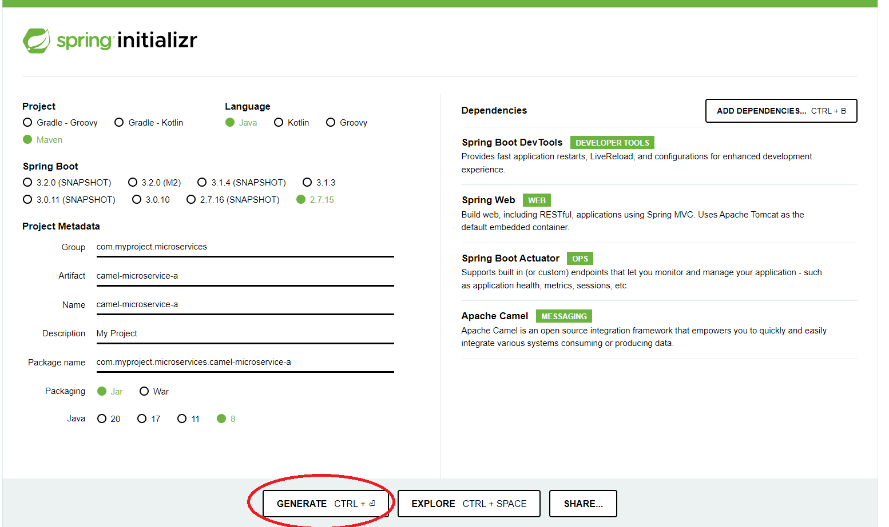
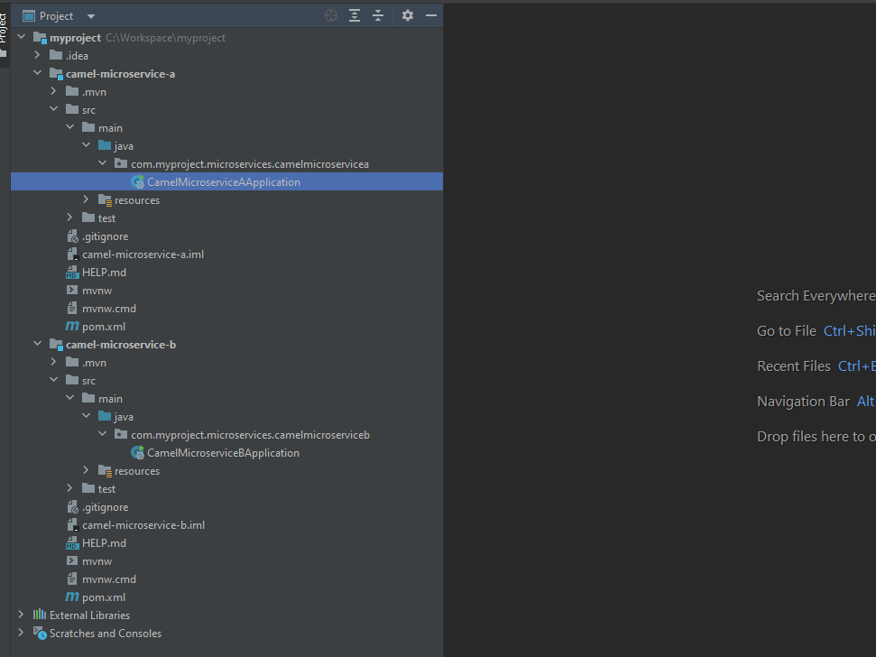
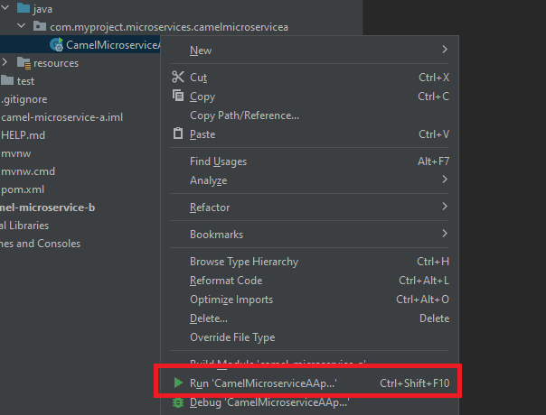
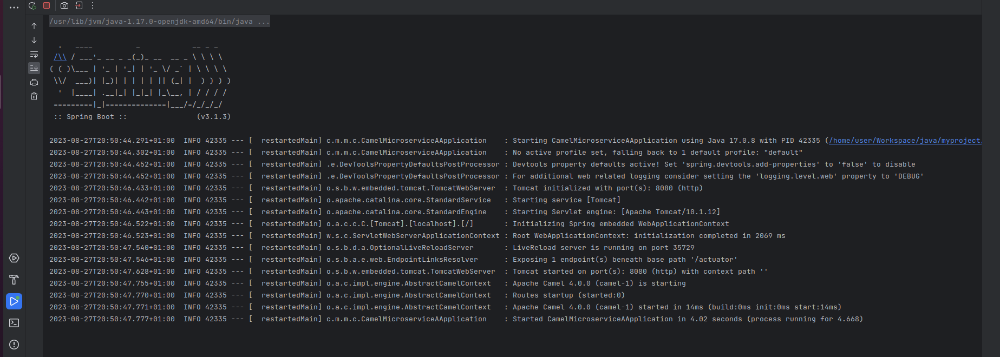

<h1 align="center"> Apache Camel </h1>

# Content

1. [Chapter 1: Introducing Camel](#chapter1)
    - [Chapter 1 - Part 1: What is Camel?](#chapter1part1)
    - [Chapter 1 - Part 2: Ab](#chapter1part2)
    - [Chapter 1 - Part 3: Ac](#chapter1part3)
2. [Chapter 2: Knowing Apache Camel](#chapter2)
    - [Chapter 2 - Part 1: Ba](#chapter2part1)
    - [Chapter 2 - Part 2: Bb](#chapter2part2)
    - [Chapter 2 - Part 3: First Project](#chapter2part3)

## Chapter 1: Introducing Camel
  
#### Chapter 1 - Part 1: What is Camel?

At the core of the Camel framework is a routing engine—or more precisely, a routing-engine builder. It allows you to define your own routing rules, decide from which sources to accept messages, and determine how to process and send those messages to other destinations. Camel uses an integration language that allows you to define complex routing rules, akin to business processes.

Camel offers higher-level abstractions that allow you to interact with various systems by using the same API regardless of the protocol or data type the systems are using.

Components in Camel provide specific implementations of the API that target different protocols and data types. Out of the box, Camel comes with support for more than 280 protocols and data types. Its extensible and modular architecture allows you to implement and seamlessly plug in support for your own protocols, proprietary or not.

#### Chapter 1 - Part 1: What Camel isn’t?

We should also mention what Camel isn’t. Camel isn’t an enterprise service bus (ESB), although some call Camel a lightweight ESB because of its support for routing, transformation, orchestration, monitoring, and so forth. Camel doesn’t have a container or a reliable message bus, but it can be deployed in one, such as the previously mentioned Apache ServiceMix. For that reason, we prefer to call Camel an integration framework rather than an ESB.

If the mere mention of ESBs brings back memories of huge, complex deployments, don’t fear. Camel is equally at home in tiny deployments such as microservices or internet-of-things (IoT) gateways.

#### Chapter 1 - Part 1: Ac

## Chapter 2: Knowing Apache Camel
  
#### Chapter 2 - Part 1: Ba

#### Chapter 2 - Part 2: Bb

#### Chapter 2 - Part 3: First Project

Go to [Spring Initializr](https://start.spring.io/) and select the following:

- **Project**
   - Maven Project
- **Language**
   - Java
- **Spring Boot Version**
   - For Java Version 8 -> Spring Boot 2.x
   - For Java Version 17 -> Spring Boot 3.x
- **Packaging**
   - Jar
- **Java**
   - For Spring Boot 2.x -> Java Version 8
   - For Spring Boot 3.x -> Java Version 8
- **Dependencies**
   - Spring Boot DevTools -> Fast Application Restart
   - Spring Web -> To Construct Res APIs
   - Spring Boot Actuator -> Support Built in Endpoint
   - Apache Camel -> Integration Framework

  

 Fig 1 - Configure Apache Camel in Spring Initializr- (<a href='https://github.com/vitorstabile'>Work by Vitor Garcia</a>) 

 

Create Another project, but with the artifact name **camel-microservice-b**

Unzip the two projects (camel-microservice-a and camel-microservice-b) to a folder of your preference (Ex: myproject), and open the two projects using your IDE of preference. In this case, we will use the IntelliJ.

  

 Fig 2 - Import Apache Camel Projects (camel-microservice-a and camel-microservice-b) - (<a href='https://github.com/vitorstabile'>Work by Vitor Garcia</a>) 

 

IntelliJ will load the dependencies automatically when detecting a Maven Project. After all dependencies is download, try to run the CamelMicroserviceAApplication

  

 Fig 3 - Run Apache Camel Application - (<a href='https://github.com/vitorstabile'>Work by Vitor Garcia</a>) 

 

 Fig 4 - Server Runner - (<a href='https://github.com/vitorstabile'>Work by Vitor Garcia</a>) 

 

